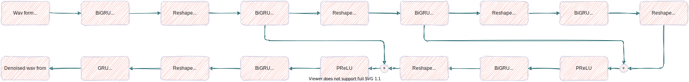

# RHRNet

* This code is a RHRNet unofficial code.

* The following is the paper I referred:

    * [Abdulbaqi, J., Gu, Y., & Marsic, I. (2019). RHR-Net: A Residual Hourglass Recurrent Neural Network for Speech Enhancement. arXiv preprint arXiv:1904.07294.](https://arxiv.org/abs/1904.07294)

# Requirements

* torch >= 1.6.0
* tensorboardX >= 2.0
* librosa >= 0.7.2
* matplotlib >= 3.1.3   

* Optional for loss flow
    * tensorboard >= 2.2.2

# Structure




# Used dataset

* Two types of datasets were used for training: speech and noise.

## Speech

* I used two English datasets and one Korean dataset.

| Dataset     | Dataset address                                 |
|-------------|-------------------------------------------------|
| VCTK        | https://datashare.is.ed.ac.uk/handle/10283/2651 |
| LibriTTS    | https://openslr.org/60/                         |
| EmoitionTTS | https://github.com/emotiontts/                  |

## I used three environment noise datasets to train and one dataset for evaluation.

| Dataset     | Dataset address                                                       |
|-------------|-----------------------------------------------------------------------|
| DEMAND      | https://zenodo.org/record/1227121                                     |
| ESC50       | https://github.com/karolpiczak/ESC-50                                 |
| RIRS noises | https://www.openslr.org/28/                                           |
| 115 Noise   | http://staff.ustc.edu.cn/~jundu/The%20team/yongxu/demo/115noises.html |


# Hyper parameters

* Before proceeding, please set the pattern, inference, and checkpoint paths in 'Hyper_Parameters.yaml' according to your environment.

* Sound
    * Setting basic sound parameters.
    * This model only considers the sample rate.

* Model
    * In step ratio, over 1.0 means increasing steps. Under 1.0 means compressing steps.
    * Residual sets which layer's activation is concatnated before GRU calculation.

* Train
    * Setting the parameters of training.

* Inference_Batch_Size
    * Setting the batch size when inference.
    * If `null`, it will be same to `Train/Batch_Size`

* Inference_Path
    * Setting the inference path

* Checkpoint_Path
    * Setting the checkpoint path

* Log_Path
    * Setting the tensorboard log path

* Use_Mixed_Precision
    * Setting mixed precision.
    * To use, `Nvidia apex` must be installed in the environment.
    * In several preprocessing hyper parameters, loss overflow problem occurs.

* Device
    * Setting which GPU device is used in multi-GPU enviornment.
    * Or, if using only CPU, please set '-1'.


# Run

## Command
```
python Train.py -hp <path> -s <int>
```

* `-hp <path>`
    * The hyper parameter path
    * This is required

* `-s <int>`
    * The resume step parameter.
    * Default is 0.
    * When this parameter is 0, model try to find the latest checkpoint in checkpoint path.

# Result

[Please see at the demo site](https://codejin.github.io/RHRNet_Demo/index.html)

# Future works

* Adding some BGM as noise